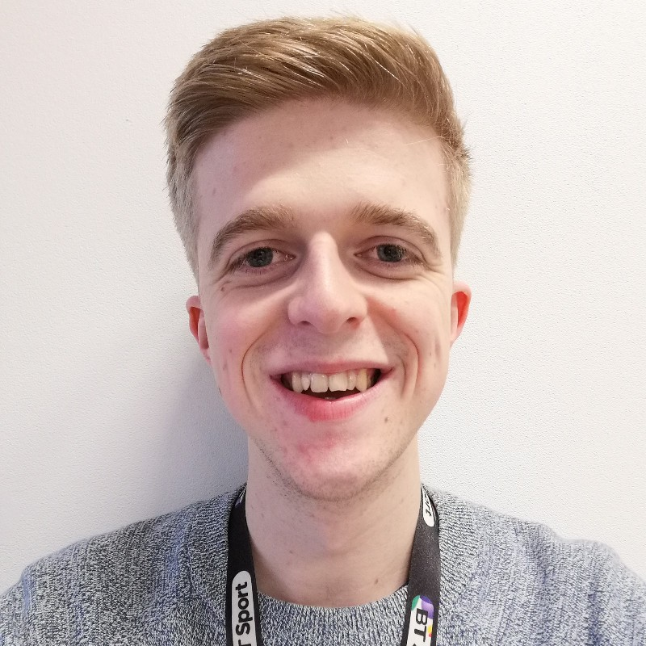

# About Me

  

I am a software developer with 7 years experience, primaily writing Ruby on Rails applications.

To contact me use one of the links in the footer.

## Technical Skills
- Programming – primarily with Ruby, some experience with Go & Crystal.
- Agile software development – using Kanban, working in small iterations with close interaction with customers.
- Software design – developing maintainable code, passionate about best practices and design patterns.
- Web development – Ruby on Rails, HTML, CSS, JavaScript, Hotwire, RESTful APIs.
- TDD and BDD – Experience with RSpec, Cucumber, Capybara, Cypress, Mocha & Jest.
- Databases – PostgreSQL, some experience with MySQL and NoSQL technology such as ElasticSearch & MongoDB.
- DevOps – provisioning infrastructure with Ansible, resolving live issues and scaling applications.
- Other languages and skills – Elm, Node.js, Bash, CI/CD (Jenkins & GitLab), Git, Vim, Kafka, Nginx & Grafana.